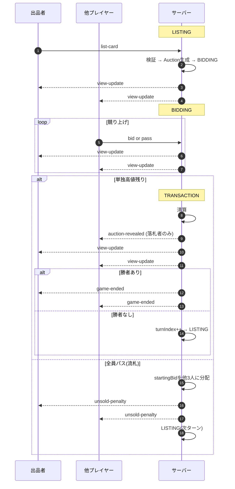

# 01. シーケンス

状態機械・フェーズ遷移は [03_state_flow.md](./03_state_flow.md) を参照。

## 1ターンのシーケンス

## 接続ライフサイクル

ルーム作成・参加・離脱は REST(ユーザーが手動操作)、オンライン状態同期は Socket.IO。

| イベント | フェーズ | 動作 |
|---|---|---|
| ルーム作成 | — | `POST /rooms` で合言葉発行、主催者は続けて参加リクエスト(REST) |
| ルーム参加 | LOBBY | `POST /rooms/:passphrase/players` で addPlayer(REST) |
| Socket 新規接続 | LOBBY | 既参加なら online=true に戻し、未参加なら観戦のみ |
| Socket 再接続 | 進行中 | 席に復帰、online=true、直後に `view-update` を1回受信 |
| 新規接続 | 進行中 | 参加不可、観戦のみ(`self: null` で view 受信) |
| ルーム離脱 | LOBBY | `DELETE /rooms/:passphrase/players/me`(REST) |
| Socket 切断 | LOBBY 既参加 | 即座に離脱(他プレイヤーが参加できるように) |
| Socket 切断 | 進行中 | online=false で席を保持、再接続待ち |

- Socket.IO 接続時は `auth.playerId` / `auth.roomId` 必須(いずれか未設定なら接続拒否)
- 型付けされたイベント契約は `shared/events.ts`
- 切断タイムアウトによる強制離脱は非対応(無期限保持)
- 出品者オフラインのままでも進行を自動再開しない(`03_state_flow.md` 参照)
