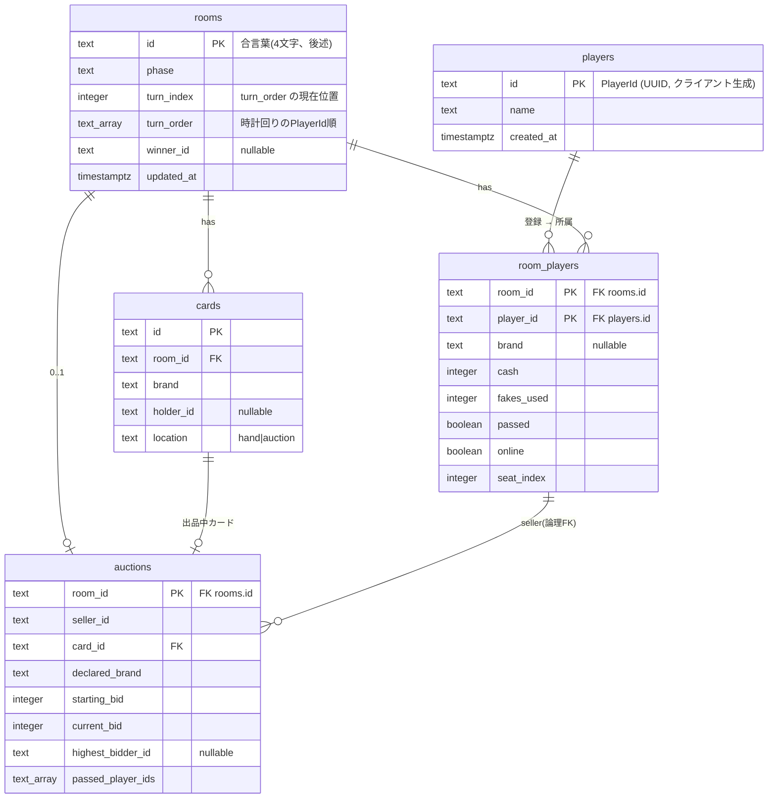

# 02. データモデル

## 永続化スキーマ

Drizzle ORM で定義(`packages/server/src/db/schema.ts`)。FK は `rooms.id` へ `onDelete: cascade`。



補足:

- `players` は身元マスター(id PK / name / created_at)。プレイヤー登録(`POST /players`)で行を作成
- `room_players` はルーム所属 + ルーム単位のゲーム状態。`(room_id, player_id)` 複合PK、`player_id` は `players.id` への FK(`onDelete: cascade`)
- `players.id` はクライアント生成 UUID(localStorage 保持)= `PlayerId`
- `auctions` は `room_id` が PK のため1ルーム同時1件
- `cards.holder_id` / `auctions.seller_id` / `highest_bidder_id` は論理上 `room_players.player_id` 参照だが DB FK は未張り(アプリ側整合性)

## 列挙値(`shared/types.ts`)

テーブルは `text` で保持、列挙値はアプリ側で定義。

- `Brand`: `painting` | `sculpture` | `pottery` | `jewelry`
- `Phase`: `lobby` | `listing` | `bidding` | `transaction` | `ended`
- `cards.location`: `hand` | `auction`

## 視点別ビュー

サーバーが `GameState`(= DBから再構築したメモリ状態)を視点別にフィルタして配信。
秘匿情報を除去してから各クライアントへ届ける。

```ts
type PublicPlayerView = {
  id, name,
  cash, fakesUsed,
  handCount,  // 枚数のみ(内容は非公開)
  passed, online,
};

type SelfPlayerView = PublicPlayerView & {
  brand: Brand,
  hand: Card[],
};

type PublicAuctionView = {
  sellerId, declaredBrand,
  startingBid, currentBid,
  highestBidderId,
  passedPlayerIds,  // 実カード(card)は落札者確定まで非公開
};

type GameView = {
  phase, turnIndex, turnOrder, winnerId,
  self: SelfPlayerView | null,   // 観戦モード時は null
  others: PublicPlayerView[],
  currentAuction: PublicAuctionView | null,
};
```

## 隠蔽情報一覧

| 情報        | 公開  | 本人のみ    | 落札者のみ    |
| --------- | --- | ------- | -------- |
| プレイヤー名    | ○   |         |          |
| 所持金       | ○   |         |          |
| フェイク使用回数  |     | ○       |          |
| 手札枚数      | ○   |         |          |
| 自分のブランド   |     | ○       |          |
| 自分の手札内容   |     | ○       |          |
| 他人のブランド   |     | ✕(推理のみ) |          |
| 現在の競りの実種別 |     |         | ○(落札確定後) |
| 宣言種別      | ○   |         |          |
| 現在の最高入札額・入札者・パス済者 | ○ | | |

※ 入札の時系列履歴は保持しない(現在状態のみ公開)。

## マイグレーション

- `packages/server/drizzle/` に SQL 配置
- サーバー起動時 `runMigrations()` が自動適用
- スキーマ変更は `npm run db:generate` で新マイグレーション生成
