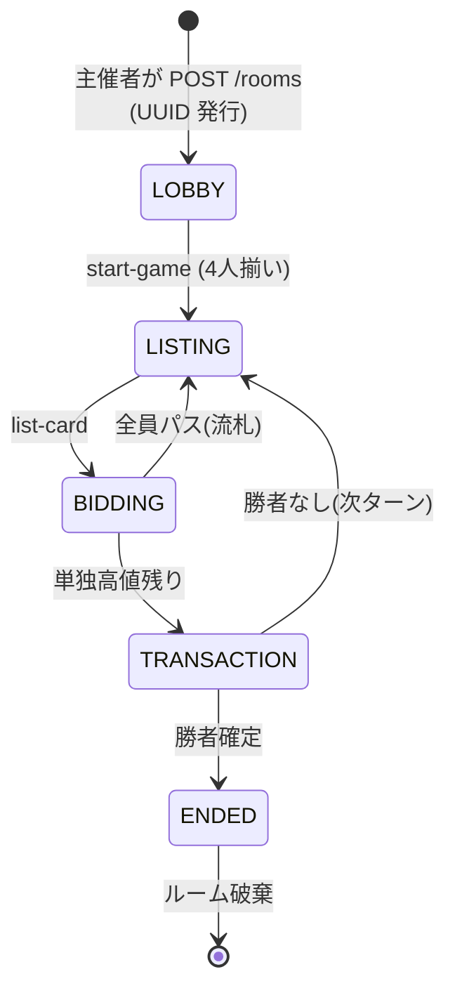

# 03. 状態遷移・主要ロジック

## フェーズ遷移



## ルームのライフサイクル

- **ルームはユーザーが手動で作成**: 自動マッチメイキング・デフォルトルームへの自動割当は行わない
- 主催者が `POST /rooms` を呼ぶとサーバーが UUID を発行 → `rooms.id` として格納
- 参加者はルーム ID(UUID)を入力 → `POST /rooms/:id/players` で参加
- **ホスト確定**: 当該ルームの初参加者が `rooms.host_player_id` に設定される(主催者が作成直後に自身を追加するフロー上、ホスト = 主催者になる)。以降は不変
- **ホスト権限**: `POST /rooms/:id/start` はホストのみ実行可(`X-Player-Id === rooms.host_player_id`)。それ以外は `403 not-host`
- **1ルーム = 1ゲーム**
- `ENDED` は終端、同一ルームでの再戦は不可
- 次戦はメンバーの誰かが `POST /rooms` で新規ルーム(新たな合言葉)を作成し、他メンバーが再参加(別ルームではホストが変わってよい)
- 過去ルーム / 合言葉の扱い: ENDED 後もレコード保持、合言葉は再利用しない(運用判断)

## フェーズごとの許可操作

| フェーズ | 許可イベント | チャネル | 実行主体 |
|---|---|---|---|
| LOBBY | `POST /rooms/:id/players`, `DELETE /rooms/:id/players/me` | REST | 全員 |
| LOBBY | `POST /rooms/:id/start` | REST | ホストのみ |
| LISTING | `list-card` | Socket.IO | 出品者のみ |
| BIDDING | `bid`, `pass` | Socket.IO | 出品者以外 |
| TRANSACTION | (同一Txで自動処理、DBに永続化されない概念フェーズ) | — | — |
| ENDED | なし(`POST /rooms` で新ルーム作成へ) | — | — |

## 初期化(`POST /rooms/:id/start`)

- 4ブランドを4プレイヤーにランダム割当
- 各プレイヤーに自ブランドのカードを4枚生成して手札へ
  - カードID生成規則: `${brand}-${playerIndex}-${k}` (k=0..3)
- `cash = 100`, `fakesUsed = 0`, `passed = false`
- `turnOrder` をシャッフルして決定
- phase: LOBBY → LISTING

## 出品検証(`list-card`)

- sender が `turnOrder[turnIndex]` と一致
- `cardId` が sender の hand に存在
- `declaredBrand` が `Brand` 型のいずれか
- `declaredBrand !== sender.brand`(フェイク)の場合
  - `sender.fakesUsed < 2` を要求、超過なら拒否
- `0 <= startingBid <= sender.cash`
- 合格時
  - 全プレイヤーの `passed` を `false` にリセット
  - `Auction` 生成、`currentBid = startingBid`, `highestBidderId = null`
  - `auction_actions` は空状態(前オークションのレコードは settle 時に CASCADE 削除済み)
  - phase: LISTING → BIDDING

## 入札検証(`bid`)

- phase が BIDDING
- sender が `currentAuction.sellerId` でない
- sender が `passedPlayerIds` に含まれない
- 最低額
  - 初回入札(`highestBidderId === null`): `amount >= startingBid`
  - 2回目以降: `amount >= currentBid + 1`
- `amount <= sender.cash`
- 合格時
  - `currentBid` と `highestBidderId` を更新
  - `auction_actions` に `{ type: "bid", playerId: sender, amount, seq: 次の連番 }` を append
  - ブロードキャスト

## パス処理(`pass`)

- sender を `passedPlayerIds` に追加
- `auction_actions` に `{ type: "pass", playerId: sender, amount: null, seq: 次の連番 }` を append
- 残り入札者が1人(or 全員パス)で競り終了
  - 高値入札者あり → TRANSACTION
  - 全員パス → 流札処理 → LISTING(次ターン)

## 流札処理

- `seller.cash -= startingBid`
- 他3プレイヤーに `floor(startingBid / 3)` ずつ分配
- 端数は出品者吸収
- カードは seller の hand に戻る
- `fakesUsed` は増やさない
- `auctions` 行を削除 → CASCADE で `auction_actions` も削除
- `unsold-penalty` イベント送信

## 取引処理(TRANSACTION)

- `highestBidder.cash -= currentBid`
- `seller.cash += currentBid`
- カードを `seller.hand` → `highestBidder.hand` へ移動(落札カードは以降再出品可)
- `auction-revealed` を落札者のみに送信
- 宣言 ≠ 実種別なら `seller.fakesUsed += 1`
- `auctions` 行を削除 → CASCADE で `auction_actions` も削除
- 勝利判定
  - 落札者の `hand` に4ブランド全種 → `winnerId` 設定、phase: ENDED、`game-ended` 送信
  - 未達 → `turnIndex++` で LISTING へ

## 勝利判定(純粋関数、`shared/rules.ts`)

```ts
export function hasFullSet(player: Player): boolean {
  const brands = new Set<Brand>();
  for (const c of player.hand) brands.add(c.brand);
  return brands.size === 4;
}
```

## トランザクション境界

各 Socket.IO / REST ハンドラが `withTx` で単一トランザクションを形成。

1. `loadRoomState(tx)` で DB からフル状態を再構築
2. `gameEngine` の純粋関数でメモリ上の状態を変更
3. `saveRoomState(tx, state)` で全テーブルを削除+再挿入
4. コミット後に Socket.IO でビュー配信

イベント単位の ACID を担保。楽観ロック未実装、同一ルーム内の並行書き込みは直列化のみ。

## 制約・既知の限界

- **出品者オフライン時の進行停止**: 現出品者が切断するとターンを回せず進行停止、タイムアウトや自動パスは非対応(再接続を待つ)
