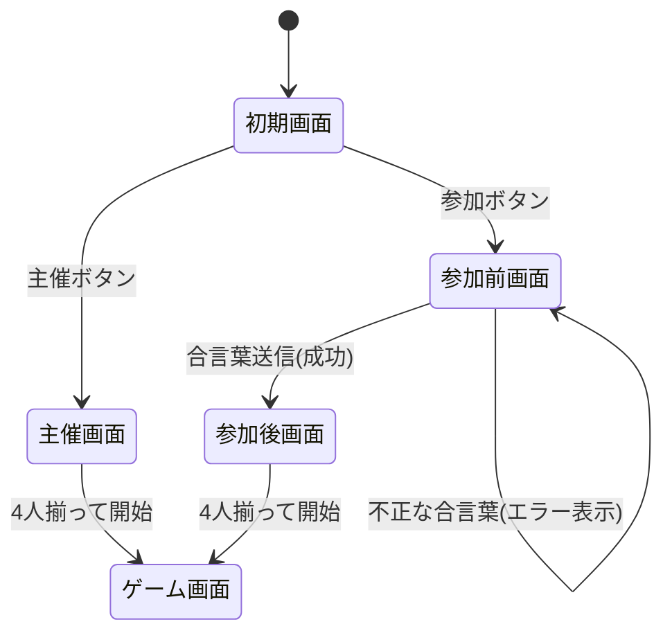

# 05. フロントエンド設計

## 全体構成

ゲーム開始(`POST /rooms/:id/start` 成功 → phase = LISTING)を境に、画面体験を **ゲーム前(プレロビー)** と **ゲーム中(プレイ)** の 2 系統に分ける。

```
ゲーム前(phase = lobby) ──── start ────▶ ゲーム中(phase = listing/bidding/transaction/ended)
  - 認証/登録
  - ルーム選択
  - 入室・参加待機
                                            - オークション進行
                                            - 勝者確定 → 終了画面
```

- 各系統の中で更に画面が遷移する
- ゲーム中は phase 遷移と即時連動して UI が切り替わる(画面遷移ではなく状態更新で表示)

## 共通ヘッダー

- プレイヤー登録画面以外の全画面で、画面上部に常に自分のユーザー名(Zustand store の `userName`)を表示
- 表示位置は固定ヘッダー、どの画面(ルーム一覧/ロビー/ゲーム/終了)でも視認できる
- 目的: 現在どのアカウントでプレイしているかを常に明示
- 実装: App 直下の `<UserBadge />` 共通コンポーネント

---

## ゲーム前(プレロビー)

ゲーム開始までの導線。**合言葉**(ルームを一意に特定する 4 桁の文字列)を介して主催側と参加側が出会う方式。

### 画面遷移



### 起動時の整合性チェック

初期画面に到達する前にバックグラウンドで実行。

- localStorage に `bluff-auction.playerId` がある場合は `GET /players/me` で検証
  - 200: `name` を Zustand store の `userName` に反映、ヘッダーに表示して初期画面へ
  - 404: localStorage を削除、初期画面ではプレイヤー名非表示(主催/参加押下時に登録フローへ誘導)
  - ネットワークエラー: エラー表示 + 再試行
- 未登録のまま「主催」「参加」を押した場合はプレイヤー登録モーダルへ遷移し、登録後に元の操作を継続

### 1. 初期画面

- 「主催」「参加」の 2 ボタンを中央に配置
- ヘッダー右上: 登録済みなら `userName` 表示、未登録なら非表示
- 主催 → 主催画面、参加 → 参加前画面

### 2. 主催画面

- ルーム作成(`POST /rooms`)直後に表示
- **合言葉**を大きく表示(他参加者に伝える用、コピー可)
- 参加プレイヤー一覧(自分含む、最大 4 名、`view-update` で更新)
- 4 人揃った時点で「ゲーム開始」ボタンが有効化(主催のみ押下可)
- 「退出」で初期画面へ戻る(ルーム破棄)

### 3. 参加前画面

- 合言葉入力フィールド + 「参加」ボタン
- 送信時、サーバーが合言葉を解決してルームに参加(`POST /rooms/:passphrase/players` 相当)
- 失敗(存在しない/満員/進行中)はエラー表示してフィールドに残留
- 「戻る」で初期画面へ

### 4. 参加後画面

- 主催画面とほぼ同レイアウト
- 合言葉と参加プレイヤー一覧を表示
- 「ゲーム開始」ボタンは主催者のみ操作可(参加者側は表示のみ、開始を待つ)
- 「退出」で初期画面へ戻る

### 合言葉について

- ルーム作成時にサーバーで 4 桁の文字列を発行(衝突しないように一意性担保)
- 既存の `room_id`(UUID)とは別の検索キー、もしくは UUID を 4 桁化して兼用
- ENDED ルームは合言葉として再利用しない(終端後に解放)
- 詳細仕様(文字種・有効期限・大文字小文字)は別途検討

---

## ゲーム中(プレイ)

`phase ≠ lobby` の間ずっと表示される画面。phase に応じて中央領域の操作が変わる。

### D. ゲーム画面(phase = listing / bidding / transaction)

```
┌───────────────────────────────────────────┐
│ UserBadge(固定ヘッダー)                  │
├───────────────────────────────────────────┤
│ 上段: 他プレイヤー 3 人                   │  ← OpponentList
│   名前 / 所持金 / カード枚数 / 状態       │
├───────────────────────────────────────────┤
│ 中段: 競り場(現在の出品状況)            │  ← AuctionArea
│   出品者 / 宣言ブランド / 現在最高入札    │
│   ─ 自分が出品者:                         │
│       カード選択 → 宣言 → 開始額 → 出品   │
│   ─ 自分が入札者:                         │
│       入札額入力 / パス                   │
│   ─ 自分が傍観:                           │
│       状況表示のみ                        │
├───────────────────────────────────────────┤
│ 下段: 自分の手札 / 所持金 / フェイク残数  │  ← MyHand, MyStats
└───────────────────────────────────────────┘
```

- phase 遷移は `view-update` イベントで即時反映(画面遷移なし、コンポーネント再レンダリング)
- LISTING / BIDDING / TRANSACTION は同じレイアウト、中段の操作のみ切り替わる
- 落札確定時 `auction-revealed` を落札者のみが受信し、`lastRevealed` に格納してハイライト表示

### E. 終了画面(phase = ENDED)

- ゲーム画面と置き換わって表示
- **要素**:
  - 勝者表示
  - 「新ルーム作成(再戦)」ボタン(`POST /rooms` → 新ルームへ遷移)
    - 同一ルームでの再戦は不可、ENDED は終端
  - 「ルーム一覧へ戻る」ボタン

---

## React コンポーネント階層

```
<App>
 ├ <NameRegister />                  プレイヤー登録(localStorage 未登録時のみ、UserBadge は非表示)
 ├ <UserBadge />                     登録後は常時表示
 ├──────────── ゲーム前 ────────────
 ├ <RoomList />                      ルーム未選択時
 ├ <Lobby />                         phase = lobby
 ├──────────── ゲーム中 ────────────
 ├ <GameBoard>                       phase = listing/bidding/transaction
 │   ├ <OpponentList />
 │   ├ <AuctionArea>
 │   │   ├ <ListingForm />           自分が出品者時
 │   │   ├ <BiddingForm />           自分が入札者時
 │   │   └ <AuctionStatus />
 │   ├ <MyHand />
 │   └ <MyStats />
 └ <EndedScreen />                   phase = ended
```

ルーティング判定(`App.tsx`):

| 状態 | 表示 |
|---|---|
| `userName` 未取得 | NameRegister |
| `roomId` 未選択 | RoomList |
| `view.phase === "lobby"` | Lobby |
| `view.phase === "ended"` | EndedScreen |
| その他(listing/bidding/transaction) | GameBoard |

## 状態管理

Zustand store で以下を保持:

| キー | 型 | 用途 |
|---|---|---|
| `userName` | `string \| null` | 起動時 `GET /players/me` / 登録後に設定。UserBadge ・参加リクエストで参照 |
| `roomId` | `string \| null` | 入室中ルーム |
| `view` | `GameView \| null` | サーバーからの `view-update` で置換、UI 全体の真実源 |
| `lastRevealed` | `{ brand: Brand } \| null` | `auction-revealed` 受信時に設定、自分が落札したカードの実種別をハイライト |
| `winnerId` | `PlayerId \| null` | `game-ended` 受信時に設定 |
| `lastError` | `string \| null` | `error-event` 受信時に設定 |

各コンポーネントは必要部分のみ select してレンダリング。

## 補助定義

- `BRAND_LABELS`(`shared/constants.ts`): ブランド英語キー → 日本語ラベル対応(例: `painting` → 「絵画」)
- 画面表示には必ず `BRAND_LABELS[brand]` を経由
