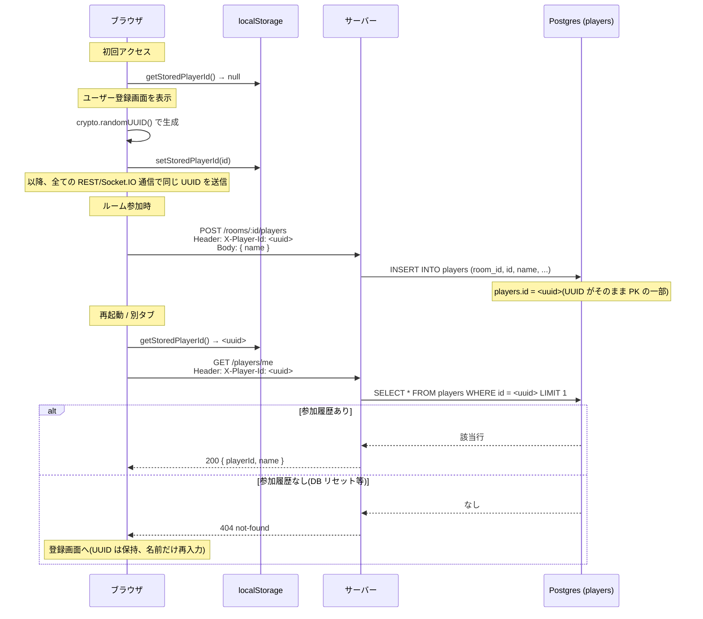
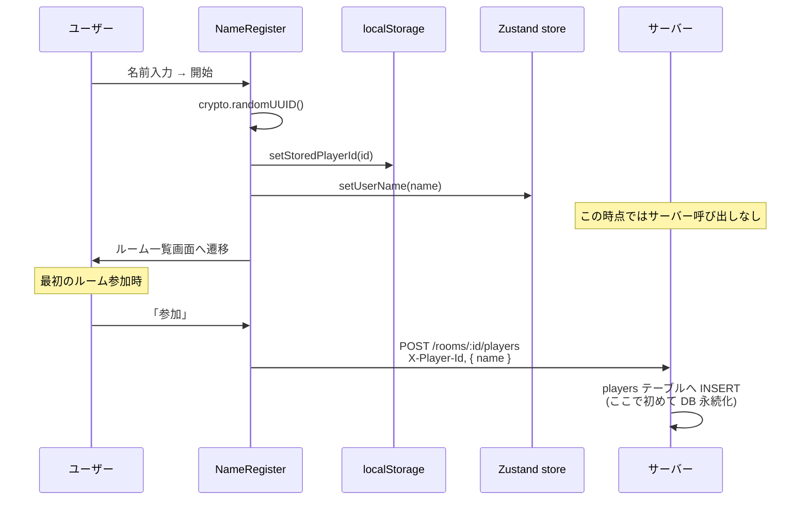
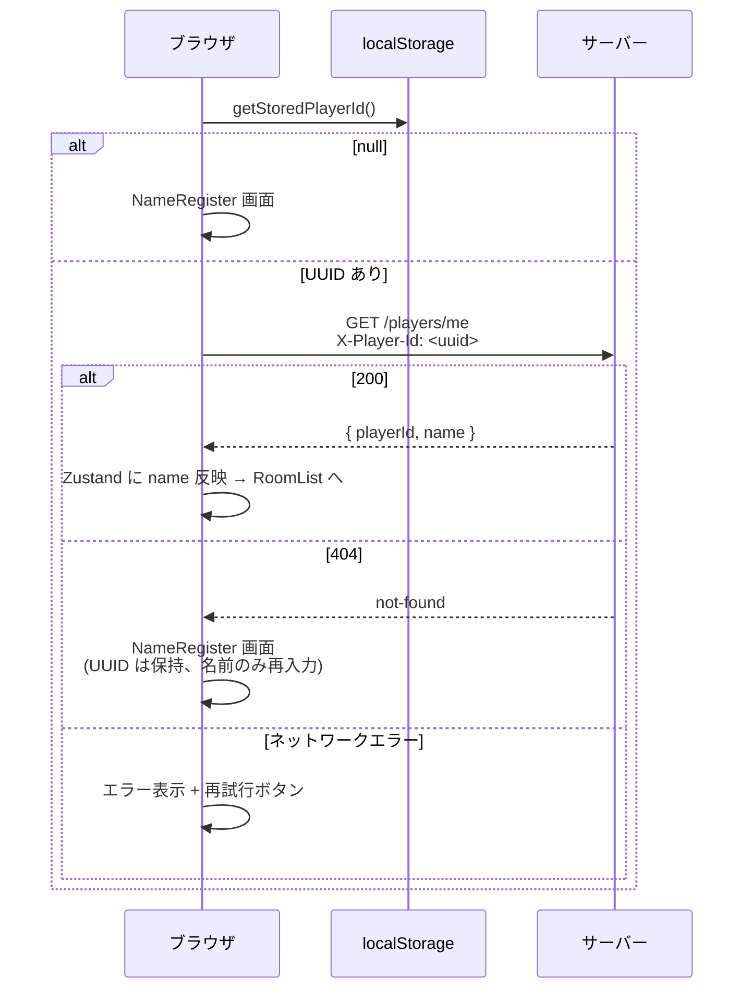

# 06. プレイヤー認証

クライアント/サーバー間のプレイヤー識別と認証の全体像。

## 概要

- **独立したユーザーテーブルなし**: `users` のような永続テーブルは持たず、`players` 行で識別
- **認証強度**: プロトタイプ向けに UUID のみで識別(トークンやパスワードなし、なりすまし可能)
- **スコープ**: 友人内プレイ想定、本格認証は範囲外

## 識別子の生成とライフサイクル



## localStorage

| key | value | 用途 |
|---|---|---|
| `bluff-auction.playerId` | UUID 文字列 | プレイヤー識別子 |

- 未保存 → ユーザー登録画面
- 保存済 → 起動時に `GET /players/me` で検証
- 表示名は localStorage に保存せず、Zustand store でメモリ保持

## REST 通信

### ヘッダ

| ヘッダ | 値 | 必須化 |
|---|---|---|
| `X-Player-Id` | localStorage の UUID | ルーム参加/離脱/開始・自分情報取得で必須 |

欠落すると 401 `{ code: "unauthorized", message: "X-Player-Id ヘッダが必要" }` を返す。

### 未登録時の挙動

- クライアントは `getStoredPlayerId()` が null の間は `X-Player-Id` を付与しない
- ルーム参加系は 401 になるため、そもそも未登録で呼び出さない UI 設計
- `GET /rooms` のような認証不要エンドポイントは未登録でも呼べる

## Socket.IO 通信

### handshake

```ts
io(SERVER_URL, { auth: { playerId, roomId } })
```

- サーバー側 `io.use` ミドルウェアで `playerId` と `roomId` の両方を検証
- いずれか欠落で `next(new Error(...))` により接続拒否
- `socket.data.playerId` / `socket.data.roomId` に保持、以降のイベントハンドラで参照

### ルーム単位の隔離

- `socket.join(roomId)` でルームにバインド、`io.to(roomId).emit(...)` で対象ルームのみへブロードキャスト
- `auction-revealed` は `playerSocketMap.get(playerId)` で該当 socket を特定し、個別 emit

## 登録フロー詳細

### 初回登録



### 起動時の整合性チェック



## 再接続時

- Socket.IO 切断 → 再接続すると handshake の `auth.playerId` で同一プレイヤーとして復帰
- サーバー側は `players.online = true` に戻し、`broadcastViewsFromState` で最新状態を再配信
- ゲーム進行中に席を失うことはない(切断タイムアウトによる強制離脱は非対応)

## 制約

- **なりすまし**: UUID さえ知れば誰でも他人になれる。本番利用では認証強化必須
- **マルチデバイス不可**: 同一 UUID で同時接続すると `playerSocketMap` が上書きされ最新 socket のみ有効
- **DB リセット耐性**: `players` テーブルがリセットされると全 UUID が 404、再登録画面が出る(UUID 自体は保持)
